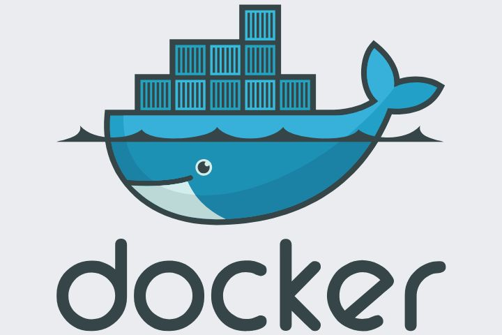
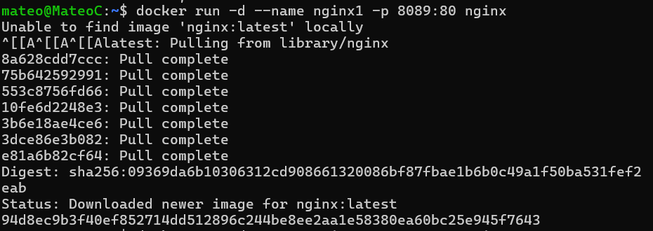
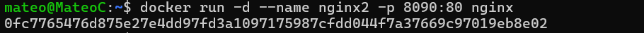
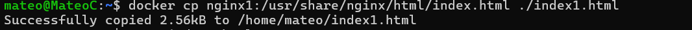
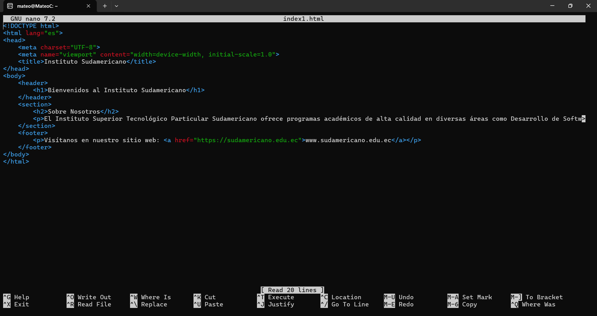
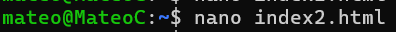
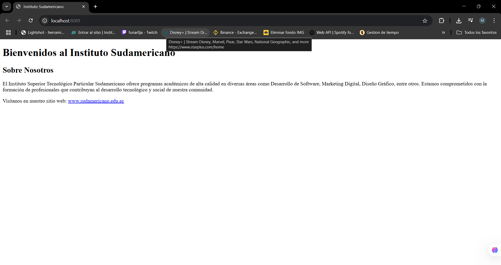
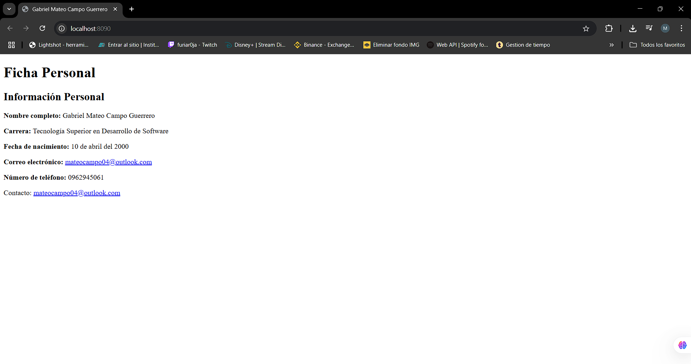
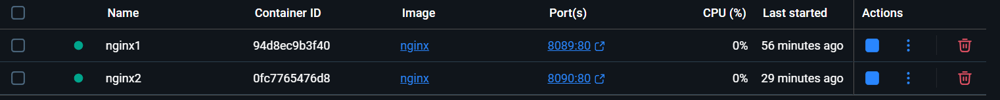

# Informe de la Práctica: Creación y Personalización de Servidores Web con Nginx usando Docker

## 1. Título
Creación y Personalización de Dos Servidores Web con Nginx utilizando Docker

## 2. Tiempo de duración
90 minutos

## 3. Fundamentos

En esta práctica se trabajó con la creación de servidores web utilizando la imagen oficial de Nginx en Docker. El objetivo fue desplegar dos contenedores de Nginx y personalizarlos con información diferente en cada uno. Utilizando Docker como herramienta de contenedores, es posible crear, gestionar y desplegar aplicaciones de forma eficiente y aislada. Esta práctica también implica la manipulación de archivos dentro de los contenedores Docker.

<p align="center">
  
</p>

### Comandos Utilizados:

- **docker run**: Permite ejecutar contenedores en Docker.
- **docker cp**: Permite copiar archivos entre el sistema anfitrión y el contenedor.
  
## 4. Conocimientos previos

- Conocimiento básico de Docker y Nginx.
- Experiencia en manejo de contenedores.
- Conceptos básicos de imágenes y volúmenes en Docker.

## 5. Objetivos a alcanzar

- Crear y personalizar dos servidores web utilizando Nginx en contenedores Docker.
- Modificar el archivo `index.html` en cada contenedor para mostrar contenido personalizado.
- Familiarizarse con los comandos `docker run` y `docker cp` para manipulación de contenedores y archivos.

## 6. Equipo necesario

- **Computadora con Docker instalado**: Se utilizó un sistema operativo Linux (Ubuntu) con Docker instalado para realizar la práctica.
- **Editor de texto**: Para modificar el archivo `index.html` en cada contenedor.
- **Acceso a terminal**: Para ejecutar los comandos de Docker.

## 7. Material de apoyo

- Documentación oficial de Docker: [https://docs.docker.com/](https://docs.docker.com/)
- Guía rápida de Nginx: [https://nginx.org/en/docs/](https://nginx.org/en/docs/)

## 8. Procedimiento

### Paso 1: Crear el primer contenedor Nginx
El primer contenedor se ejecuta con el siguiente comando:
```bash
docker run -d --name nginx1 -p 8089:80 nginx
```
Este comando ejecuta Nginx en un contenedor llamado `nginx1`, exponiendo el puerto 8089.

<p align="center">
  
</p>

### Paso 2: Crear el segundo contenedor Nginx
El segundo contenedor se ejecuta con el siguiente comando:
```bash
docker run -d --name nginx2 -p 8090:80 nginx
```
Este comando ejecuta Nginx en un contenedor llamado `nginx2`, exponiendo el puerto 8090.

<p align="center">
  
</p>

### Paso 3: Copiar el archivo `index.html` desde el contenedor nginx1 al sistema anfitrión
```bash
docker cp nginx1:/usr/share/nginx/html/index.html ./index1.html
```
Este comando copia el archivo `index.html` desde el contenedor `nginx1` al sistema anfitrión.

<p align="center">
  
</p>


### Paso 4: Editar el archivo `index1.html` con información institucional
Se edita el archivo utilizando un editor de texto como `nano` o `vi` y se personaliza con información institucional.

```bash
nano index1.html
```

<p align="center">
  
</p>

Reemplazamos el contenido por el que nosotros queremos: 


<p align="center">
  
</p>

### Paso 5: Copiar el archivo editado de vuelta al contenedor `nginx1`
```bash
docker cp index1.html nginx1:/usr/share/nginx/html/index.html
```
Este comando copia el archivo editado de nuevo al contenedor `nginx1`, actualizando el contenido de la página web.

### Paso 6: Repetir el proceso para el segundo contenedor `nginx2`
Se repiten los mismos pasos para el segundo contenedor `nginx2`, personalizando el archivo `index.html` con información personal del estudiante.

<p align="center">
  
</p>

Reemplazamos el contenido por el que nosotros queremos: 


<p align="center">
  
</p>


## 9. Resultados

Al finalizar la práctica, los resultados obtenidos fueron los siguientes:

- El primer contenedor `nginx1` mostró correctamente la información institucional en el navegador al acceder a `http://localhost:8089`.

<p align="center">
  
</p>

- El segundo contenedor `nginx2` mostró la información personal del estudiante en el navegador al acceder a `http://localhost:8090`.

<p align="center">
  
</p>

Ambos contenedores fueron configurados correctamente y se pudo acceder a las páginas web personalizadas sin problemas.

<p align="center">
  
</p>

## 10. Conclusiones

Esta práctica permitió entender cómo Docker puede ser utilizado para crear y gestionar servidores web con Nginx de manera sencilla. Al manipular archivos dentro de los contenedores, se aprendió a personalizar el contenido servido por Nginx y cómo interactuar con el sistema de archivos del contenedor.

## 11. Bibliografía

- Docker Documentation. (2024). *Docker Docs*.  
Disponible en [https://docs.docker.com/](https://docs.docker.com/)

- Nginx Documentation. (2024). *Nginx Docs*.  
Disponible en [https://nginx.org/en/docs/](https://nginx.org/en/docs/)
